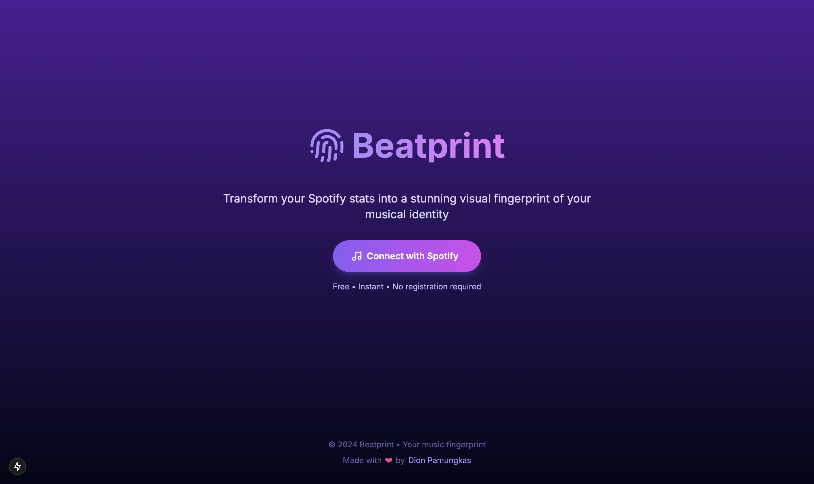

# 🎵 Beatprint - Your Musical Festival Poster Generator

Generate beautiful, festival-style posters based on your Spotify listening history. Turn your music taste into a personalized festival lineup where your top artists are the headliners!



## ✨ Features

- 🎨 Festival-style poster generation
- 🎵 Integration with Spotify API
- 👤 Personal listening statistics
- 🔄 Real-time data updates
- 📱 Responsive design
- 💫 Beautiful animations
- 📥 Download posters as images
- 📲 Easy social media sharing

## 🚀 Tech Stack

- Next.js 14
- TypeScript
- Tailwind CSS
- Spotify Web API
- Lucide Icons
- HTML2Canvas

## 📦 Installation

1. Clone the repository:
```bash
git clone https://github.com/dionarya23/beatprint.git
cd beatprint
```

2. Install dependencies:
```bash
npm install
```

3. Create a `.env.local` file in the root directory with your Spotify API credentials:
```env
NEXT_PUBLIC_SPOTIFY_CLIENT_ID=your_spotify_client_id
NEXT_PUBLIC_REDIRECT_URI=http://localhost:3000
```

4. Start the development server:
```bash
npm run dev
```

## 🔑 Spotify API Setup

1. Go to [Spotify Developer Dashboard](https://developer.spotify.com/dashboard)
2. Create a new application
3. Add `http://localhost:3000` to Redirect URIs
4. Copy your Client ID to the `.env.local` file

## 📁 Project Structure

```
beatprint/
├── src/
│   ├── app/
│   │   ├── page.tsx
│   │   ├── layout.tsx
│   │   ├── globals.css
│   │   └── dashboard/
│   │       └── page.tsx
│   ├── components/
│   │   └── FestivalPoster.tsx
│   └── lib/
│       ├── spotify.ts
│       └── utils.ts
├── public/
├── package.json
└── README.md
```

## 🛠️ Key Components

### FestivalPoster
The main poster component that displays your music data in a festival lineup style.

### Dashboard
Handles authentication and data fetching from Spotify API.

### Spotify Integration
Manages API calls and data processing for your Spotify statistics.

## 📱 Features Breakdown

### Authentication
- Spotify OAuth 2.0 integration
- Secure token handling
- Automatic token refresh

### Poster Generation
- Festival-style layout
- Dynamic headliner sizing
- Genre categorization
- Special performances section
- Interactive elements

### Export Options
- High-quality image download
- Social media sharing
- Link copying

## 🚀 Deployment

Deploy to Vercel:

```bash
vercel
```

Remember to add your environment variables to your deployment platform.

## 📝 Usage

1. Visit the website
2. Connect your Spotify account
3. Wait for your data to load
4. Download or share your generated poster
5. Enjoy your personalized festival lineup!

## ⚙️ Development

Running tests:
```bash
npm run test
```

Building for production:
```bash
npm run build
```

## 🙏 Acknowledgments

- Spotify Web API
- Next.js Team
- Tailwind CSS Team
- All Contributors

## 👤 Author

Dion Pamungkas
- GitHub: [@dionarya23](https://github.com/dionarya23)

## ✨ Show your support

Give a ⭐️ if this project helped you!

---

Made with ❤️ by Dion Pamungkas